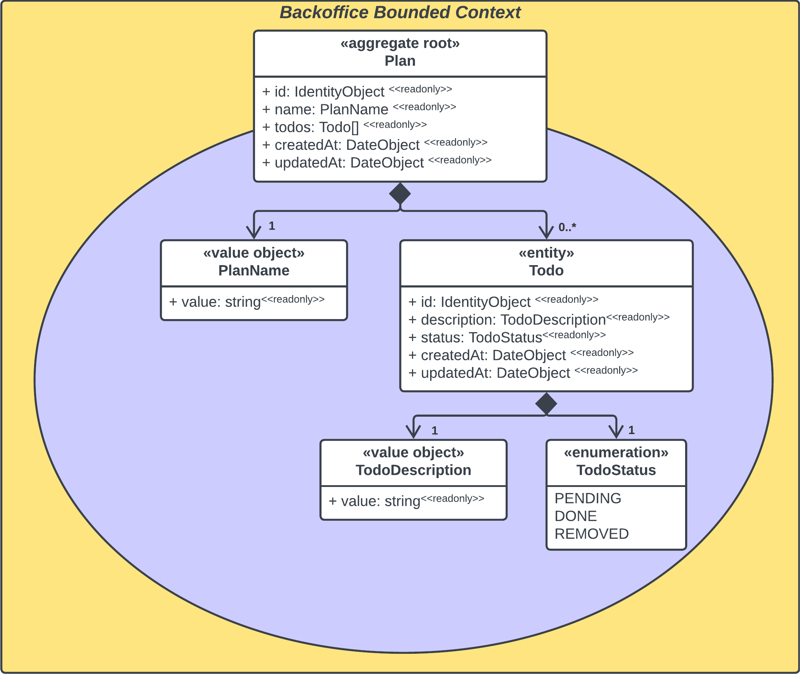

  

> Arpeggio streamlines the onboarding process for projects grounded in **_Clean Architecture_** and **_Domain-driven Design (DDD)_**

## MANIFESTO

Welcome to _[Arpeggio](https://github.com/isaacdecoded/arpeggio)_, a curated and minimalistic coding template that includes a set of artifacts that help kickstart projects based on **Domain-Driven Design (DDD)**. Moreover, _Arpeggio_ adopts a layered architecture approach by offering an organized directory and data structure definitions in line with the **Clean Architecture premise, which incorporates SOLID principles.**

It's crucial to understand that **DDD** **IS NOT about coding or defining data states, but rather a process of modeling specific business use case concepts. Consequently, this project IS NOT a formula for a _best-of-all_ domain model, assuming such a thing exists**. While this project serves as a straightforward coding template for DDD-based projects, its implementation alone won't guarantee well-designed domain models. In other words, **a well-defined domain model relies on thorough business case concept analysis that underpins all the implemented artifacts** (_Aggregates, Entities, Value Objects, Services, Repositories, Factories, and Modules_), regardless of the paradigm or approach (OOP, FP, etc.) you eventually adopt.

For this project to be useful and to avoid any confusion while practicing the DDD guidelines, consider these seven starting points:

1.  **Keep in mind that you are modeling concepts.** It's easy to get sidetracked by data-driven ideas or infrastructure implementation details. In the initial stage, our goal is to model business use case concepts. For example, "_in an E-commerce context, Users can place Orders, which can be tracked by a unique Identifier Number and consist of at least one Order Line. These Order Lines include details such as the ordered Product and its Quantity._"
2.  **Your modeled concepts should correspond to a specific business use case only** and must naturally express it. Technically, this means that the [invariants of a domain model](https://lostechies.com/jimmybogard/2010/02/24/strengthening-your-domain-aggregate-construction/), its corrective policies, and its lifecycle should align with its intended business use case. _For example, in a Courier Context, you might want to change an Order Status from "In transit" to "Delivered", respecting all the invariants and policies it implies. Conversely, in the E-commerce Context, you might not be concerned with changing the Order Status, but rather the Order Details such as Products, Delivery Address, Payment Information, etc._
3.  **Analyze your business domain from a user's perspective.** This involves a deep dive into the use case you plan to resolve. By doing so, you can identify insights that will help you understand the real-world concepts you're aiming to model. For example, as a user, "_I place an Order for purchase Products of my interest, I want those Products to be delivered to my home Address and, if possible, apply a Discount Code over the Products price._"
4.  **Start designing models from scratch with a behaviorally semantic approach.** This way, you imbue the model with meaning right from the start, incorporating aspects of the _Ubiquitous Language_ that you might use during modeling. Ultimately, your model will narrate a sequence of events and facts, much like a story. For instance, _“a Client creates an Order. This Order validates its Order Lines for consistency and reserves the specified Products for a certain period while the Payment is processed. Finally, the Order is placed and a domain event is triggered.”_ Imagine then another _Aggregate_ from a supposed _Courier Context_ subscribing to this _Order Placed_ domain event to initiate the delivery process. And so, the story continues…
5.  **Models can naturally evolve and change over time.** It's common to refactor or add new behaviors to the model as new insights are uncovered or different solutions are explored. There's a variety of design patterns or approaches to implement, and no single "best" solution. The tactical _Aggregate Pattern_ from _DDD_ is particularly useful because it creates models that are sufficiently decoupled to allow changes and provide warnings if inconsistencies arise. Don't hesitate to improve your models when necessary.
6.  **Avoid designing overly complex models.** One of the primary goals of DDD is to maintain consistency boundaries. This means that any changes to the domain objects must preserve a state of consistency and integrity. For some business use cases, models may become so complex that they appear to endlessly expand, both conceptually and in terms of memory consumption at runtime. Therefore, it's crucial to keep models simple by dividing them into multiple small aggregates that can reference each other by their _Aggregate Root_ identity.

    Additionally, **avoid mixing read models with domain models**, or write models. In other words, there's no need to load the _Order Aggregate_ model into memory for read-only operations. Instead, create a _Read Order Model_ that displays the necessary information for your system.

7.  Lastly, **it's crucial to ensure that the business use cases are complex enough in terms of consistency boundaries** before employing Domain-Driven Design (DDD) in your project. This is because simpler solutions may suffice, such as a CRUD/Script service with POJO-based models. Therefore, **DO NOT** underestimate the power of brainstorming. Also, keep these tips in mind when modeling aggregates:
    - Opt for multiple small aggregates over large-cluster ones.
    - Use _reference by identity_ between aggregates.
    - If an aggregate's memory size becomes too large, split it into multiple instances.
    - Employ _eventual consistency_ to maintain harmony between separate aggregate instances.

## **Why “Arpeggio”?**

In a musical context, an arpeggio is a sequence of notes that are part of a chord or share the same tonality, played in succession rather than simultaneously. To put it more simply, imagine taking the notes of a chord from a scale and playing them one after another to create a melodic pattern.

Consider for a moment the structure of a layered software architecture as akin to a musical scale where the implementations that occur within each layer are the individual notes, and when triggered, they do not sound all at once but are instead activated in a deliberate sequence.

Take, for instance, the _Command_ in _CQRS_ (Command Query Responsibility Segregation). It can be likened to a chord, and its execution involves a series of processes—akin to the notes in the chord. These processes are implemented across different layers, from the _Infrastructure_ to the _Domain_. As the _Command_ propagates through each layer, it "plays" out its role, resulting in a harmonious operation that's reminiscent of an arpeggio, where each note contributes to the overall melody. This approach ensures that the system's changes are orchestrated in a cohesive and coordinated manner.

## Table of Contents

- [IMPLEMENTATION CONCERNS](#implementation-concerns)
  - [Core artifacts](#core-artifacts)
  - [Identity Object](#identity-object)
  - [Date Object](#date-object)
  - [Use Cases and CQRS](#use-cases-and-cqrs)
- [THE PLAN CONCEPT EXAMPLE](#the-plan-concept-example)
  - [Consistency boundaries](#consistency-boundaries)
  - [Business use case analysis](#business-use-case-analysis)
  - [Implementing the Arpeggio Template](#implementing-the-arpeggio-template)
- [WHAT’S NEXT](#whats-next)
- [REFERENCES](#references)

# **IMPLEMENTATION CONCERNS**

## **Core artifacts**

Arpeggio's core artifacts are arranged as per the separation of concerns proposed by [Clean Architecture](https://blog.cleancoder.com/uncle-bob/2012/08/13/the-clean-architecture.html). These include the _domain_ directory for the **entities layer**, the _application_ directory for the **use cases layer**, the _adapters_ directory for the **interface adapters layer**, and the _infrastructure_ directory for the **frameworks and drivers layer**. Here's what each directory contains:

- **Domain directory:** This includes the base artifacts for a Domain-driven Design modeling in a detailed manner. It contains the following directories:
  - **Events:** This includes domain event bus and subscriber interfaces, and the domain event abstract class for domain events logic.
  - **Models:** Here, you'll find entity, aggregate root, and value object as abstract classes, and a pair of built-in classes for Date and Identity objects.
  - **Repositories:** This contains a _Criteria Pattern_ interface that aims to facilitate querying data from the repository.
  - **Specifications:** This includes a set of classes that follows the _Specification Pattern_ proposed by the Domain-driven Design approach.
- **Application directory:** This contains the Input and Output ports interfaces that will guide the Use Cases and Presenters implementations.
- **Adapters directory:** This includes the interface for the controllers that will interact with the Use Case implementations.
- **Infrastructure directory:** This provides a basic in-memory domain event bus implementation to start handling domain events immediately.

Lastly, it's crucial to note that these _core_ definitions are not intended to be used as a _framework_. They are designed to be adaptable to changes based on system requirements and specific business use cases.

## **Identity Object**

This definition is intended as a starting point for cases where you need to move quickly and can delay decisions about domain rules around identity policies. Furthermore, to uphold the _Single Responsibility Principle_, each entity model should implement its own identity definition or consider using it under a _Shared Kernel_ relationship in the system.

It's worth noting that the generation of identity (ID) does not have a one-size-fits-all solution. The best approach depends on whether it aligns with the project’s architectural design principles. However, there are two implementation approaches to consider:

1.  **As a domain service:** If you wish to separate the repository from managing identities (IDs), you could delegate this to a _Domain Service_. This service would then be injected into _Use Cases_ at the _Application layer_.
2.  **As a repository pattern method:** This alternative solution involves delegation to the _Repository Service_ through a method that returns it. If repository services handle persistence, it could be logical for them to also manage indexing or calculating the next available identity in the “bucket”.

## **Date Object**

This definition intends to facilitate the date creation and update handling, it is important to note that dates take on certain value when using _Domain Events_ in the models.

## **Use Cases and CQRS**

Developers often grapple with the "return ID after creation" requirement, which conflicts with the _Commands_ from the _CQRS_ pattern. With Clean Architecture's Use Cases approach, this issue can be addressed based on the following assumptions:

1.  In Clean Architecture, _Use Cases_ (input ports) respect the _Commands_ rule, which states that results should not be returned after execution.
2.  By applying the _Inversion of Control_ Flow approach, _Presenters_ (output ports) are injected into _Use Cases_. These are also _execution-only interfaces_. The system can then capture intermediate data, such as newly created IDs for client-display purposes. This is done without explicitly returning any results, but it does allow communication about what has been done while executing the _Commands_.

When it comes to _Queries_ from the CQRS pattern, implementing _Use Cases_ that retrieve read models and pass them to _Presenters_ is straightforward. However, the intriguing aspect is that, **based on the _Repository Pattern_, we can achieve _Responsibility Segregation_ between _Commands_ and _Queries_.** This is done by delegating it as a detail of the repository's implementation, which is responsible for using or preparing different schemas according to the system's writing or reading requirements.

# **THE PLAN CONCEPT EXAMPLE**

Let's delve into a practical exercise that involves a modeling process. This exercise uses a _Domain-driven Design_ approach and is built using the _Arpeggio_ template. As previously stated, this is not a foolproof _recipe-like_ solution, but rather a simple example intended to illustrate and hopefully clarify the development of a business use case using _Arpeggio_ and the _DDD_ approach.

## **Consistency boundaries**

Imagine we want to develop a _Task Service_ for tracking user tasks. Initially, we plan to create a feature for task management. Therefore, the models we draft should consider the **invariants and domain rules for managing commands over these tasks**. We will incorporate these models into the _**Backoffice Bounded Context.**_

**Figure 1. Backoffice Bounded Context**

## **Business use case analysis**

Continuing with the _Backoffice Bounded Context_ idea from our in-progress _Task Service_, we'll analyze the business use case we need to model. At first glance, it may seem straightforward: "_the user manages a list of to-do items_". However, aiming for a _Domain-driven Design_ approach rather than a data-driven one, we delve deeper into what a _to-do_ item entails.

A _to-do_ is a task description that the user will mark as complete when finished. The user may also find it helpful to have a creation date for each _to-do_ to assist in priority planning.

While these concepts may not seem complex, let's look more closely at the statement: "_user could find it useful to see a creation date to better plan its priorities_". On closer reading, we discover an important insight: our business use case is about planning, not just managing to-do items. This implies that the _Task Service_ user needs to make personal **plans**.

Therefore, we decide to focus on the Plan Concept. In this context, a _plan_ is a named list of _to-dos_ responsible for maintaining list consistency. This imposes certain domain rules:

1.  Prevent duplications
2.  Control to-do manipulation, which means:
    1.  Do not allow removal or editing if the plan is complete
    2.  Check plan completeness after marking to-dos as done
3.  Plan name can be a maximum of 500 characters in length
4.  To-do descriptions can be a maximum of 1200 characters in length

Translating the above conceptual analysis into a UML diagram and incorporating DDD concepts, we can derive a model as shown in Figure 2.

**Figure 2. Plan aggregation on Backoffice Bounded Context**

The reasons for the above model are as follows:

1.  The _Plan_ model becomes an aggregate root due to **its role in maintaining consistency** within the cluster. This model includes a name, a list of to-dos, and a creation date.
2.  The _To-do_ model is represented as an entity due to the **mutability requirement of the use case**. This is primarily derived from the _mark-as-done_ behavior, which necessitates an identity. This model includes a description, its current status, and a creation date. For the _status_, we chose to implement an _enum_ rather than a _value object_ because _enums_ already adhere to the immutability property. In practice, there is no real need to implement a _value object_ based on _enum_ values to keep things simple.
3.  While identity _value objects_ are not illustrated in the figure, it's well-known in _DDD_ that all entity models have an identity, and the aggregate root is also an entity. Therefore, both our _Plan_ aggregate root and _Todo_ entity have identities.

Note that we have not yet discussed data structures, coding definitions, database schemas, etc. Even though the _Plan Concept_ example is a basic use case that could potentially be addressed with a POJO and a CRUD service, remember that this early stage of analysis is unrelated to such implementation details. We have simply analyzed concepts and created preliminary models based on discovery and brainstorming exercises. Ideally, these exercises involve the participation of the development team and so-called _Domain Experts_. It may take multiple iterations and reviews over a concept to uncover as many insights as possible that will support the models our system will depend on.

## **Implementing the Arpeggio Template**

With the first version of our Plan Aggregation model complete, we can begin building the _Task Service MVP_ using the _Arpeggio_ template. This template simplifies the translation from our conceptual model to functional code. Before we start, let's create a class diagram for a more detailed and concrete perspective:

**Figure 3. Plan aggregation UML class diagram**

In Figure 3, two classes, _IdentityObject_ and _DateObject_, are omitted from the diagram. As previously mentioned, these are built-in _Value Objects_ included in the _Arpeggio_ core definitions. The key point is that we now have a candidate model for _domain objects, their attributes, and relationships_.

This model enables us to define our aggregation behaviors. Based on our previous analysis, these behaviors can be summarized as follows:

1.  The user wants to **compile a list of to-dos** grouped **into a named plan**
2.  The user needs to be able to **add a to-do to the list**
3.  The user should be able to **remove a to-do from the list** if it is no longer viable
4.  The user might need to **modify a to-do description** due to misspellings or improvements
5.  The user needs to **mark to-dos as done** to track the progress of a plan

**Figure 4. Plan aggregation behavioral UML class diagram**

In Figure 4, certain domain object attributes are omitted to decrease cognitive load and emphasize the business use case through behavior-like naming in the domain object methods. Comparing Figure 4 to the previous list, we see a _static_ method, create(), which allows users to create a new _Plan_ in accordance with the list's first item. There are also methods such as _addTodo()_, _removeTodo()_, _changeTodoDescription()_, and _markTodoAsDone()_ to manage the to-dos, meeting the second to fifth items on the list. Further methods include _changeName()_, _isCompleted()_, and so on. Now, our model has a behavioral semantic that represents its intended business use case.

With this initial version of our domain model, which adheres to the enterprise's business rules, we can start building the application's business rules. We will use the _Clean Architecture_ approach to define the _Use Cases_ (Input Ports) objects that will interact with this _behavioral domain model_. Additionally, to apply the _CQRS pattern_, we will categorize these use cases into _Commands_ and _Queries_:

**Figure 5. Backoffice Bounded Context Commands and Queries UML use case diagram**

The next goals for our Task Service MVP involve the detailed implementation of the use cases depicted in Figure 5, the execution of these use cases by the adapters, and addressing infrastructure concerns such as repositories and services. In this context, _Arpeggio_ offers a set of basic interface definitions for Input and Output Ports and Controllers, simplifying this process. It also provides a memory-based implementation of a Domain Event Bus, which can be useful when delaying decisions on how domain events will be managed or whether the system will implement domain events (and thus tolerate eventual consistency).

To demonstrate this, let's create a sequence diagram of the 'Add Todo' use case flow. This will show how a user request is processed by various components and passes through each layer of the architecture.

**Figure 6. Add Todo use case on Backoffice Bounded Context UML sequence diagram**

At first glance, Figure 6 might seem complex for a "simple" use case. However, upon closer inspection, it becomes clear that these are purely component interactions, each having a responsibility based on its layer. Furthermore, the flow is straightforward: the _Controller_ receives the User request and prepares the request model for the _Use Case_. The _Use Case_ then executes only business logic rules over the domain layer objects (repository, aggregate, and domain event bus). This complies with the _Command's_ requirement of not returning any value. Instead, it calls the _Presenter's_ _success_ or _failure_ method with the response model. This informs the User and serves as a sort of _Anti-corruption Layer_ between the domain model and the _User_.

In conclusion, you can see the result of this development process in the programming language-specific examples below:

- [The Plan Concept on TypeScript](https://github.com/isaacdecoded/arpeggio-ts/tree/plan-concept-example)
- [The Plan Concept on Rust](https://github.com/isaacdecoded/arpeggio-rs/tree/plan-concept-example)
- [The Plan Concept on Python](https://github.com/isaacdecoded/arpeggio-py/tree/plan-concept-example)

## **CONCLUSION**

Now, based on the previous practical exercise, we can resume this development process as:
1. Brainstorming
2. Brainstorming
3. Model

## **WHAT'S NEXT**

The open-source nature of this project encourages collaborative improvement, inviting users to incorporate their preferences and practical insights into its development. Consequently, there may be room for enhancement in the _Arpeggio_ template or areas for discussion. This is particularly true given the numerous concepts, patterns, and principles that form its basis. One of the most appealing aspects of software development is its limitless capacity for evolution and the numerous ways it can address real-world scenarios.

## **REFERENCES**

The following is a list of authors, articles, and blogs that were influential in the development of this project. Predominantly, it's based on the teachings from [The Big Blue Book](https://www.domainlanguage.com/ddd/blue-book/) by Eric Evans and The [Clean Architecture](https://g.co/kgs/ELT2n7T) by Robert C. Martin.

- **Vaughn Vernon** about [Effective Aggregate Design](https://www.dddcommunity.org/library/vernon_2011/)
- **Martin Fowler** about [DDD Aggregate](https://martinfowler.com/bliki/DDD_Aggregate.html)
- **Alexey Zimarev** about [Aggregate pattern in DDD](https://blog.eventuous.dev/aggregate-pattern-in-domain-driven-design-7ad823475099)
- Probably the best [DDD sample app](https://github.com/citerus/dddsample-core) on the Internet
- [Coding for Domain-Driven Design: Tips for Data-Focused Devs](https://learn.microsoft.com/en-us/archive/msdn-magazine/2013/august/data-points-coding-for-domain-driven-design-tips-for-data-focused-devs)
- [Strengthening your domain aggregate construction](https://lostechies.com/jimmybogard/2010/02/24/strengthening-your-domain-aggregate-construction/)
- [Domain Event DOs and DONTs](https://eventuous.dev/docs/domain/domain-events/#:~:text=By%20bringing%20value%20objects%20to,events%20and%20nothing%20will%20work)
- [Entity of Value Object: that is the question](https://dariodip.medium.com/entity-or-value-object-that-is-the-question-fa1dc5d58406#:~:text=If%20you%20often%20need%20to,based%2C%20it's%20a%20Value%20Object)
- [Bounded Contexts relationships](https://ddd-practitioners.com/home/glossary/bounded-context/bounded-context-relationship/#:~:text=Anticorruption%20Layer%3A%20This%20is%20a,have%20different%20vocabularies%20or%20models)
- [Implementing Clean Architecture](https://www.plainionist.net/Implementing-Clean-Architecture-Overview/)

If the lecturer is interested, the following is a list of other intriguing texts that were explored:

- The [Aggregate Design](https://images.squarespace-cdn.com/content/v1/5d496d33d136f20001750af5/1583524520188-N2R98ASHHQ6PEI94837V/Aggregate+Design+Canvas.001.jpeg?format=2500w) canvas and an [example](https://github.com/ddd-crew/aggregate-design-canvas/blob/master/examples/naive-bank-account.jpg)
- **Udi Dahan** about avoiding deletion on [Don’t delete, just don’t](https://udidahan.com/2009/09/01/dont-delete-just-dont/)
- [The Domain Model Trilemma](https://enterprisecraftsmanship.com/posts/domain-model-purity-completeness/#:%7E:text=Domain%20model%20completeness%20%E2%80%94%20When%20all,out%2Dof%2Dprocess%20dependencies.)
- [A Clean Architecture Practical example](https://developers.redhat.com/articles/2023/08/08/implementing-clean-architecture-solutions-practical-example)
- [Hexagonal Architecture, DDD & CQRS in Typescript](https://github.com/CodelyTV/typescript-ddd-example?tab=readme-ov-file) by Codely
- [DDD articles](https://khalilstemmler.com/articles/categories/domain-driven-design/) by Khalil Stemmler
